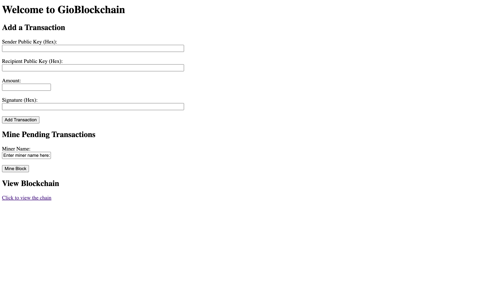

# GioBlockchain Project

This Python-based blockchain implementation demonstrates core principles like block hashing and chain validation while featuring advanced functionalities such as smart contracts, transaction validation, and decentralized networking. It simulates real-world blockchains like Bitcoin and Ethereum for learning and exploration.



---

## Table of Contents
1. [Project Overview](#project-overview)  
2. [Features](#features)  
3. [Tech Stack](#tech-stack)  
4. [Installation & Setup](#installation--setup)  
5. [Usage](#usage)  
   - [Running the Flask App](#running-the-flask-app)  
   - [Adding Transactions](#adding-transactions)  
   - [Mining Blocks](#mining-blocks)  
   - [Viewing the Blockchain](#viewing-the-blockchain)  
6. [File/Folder Breakdown](#filefolder-breakdown)  
7. [Credits](#credits)  

---

## Project Overview

This is a **simple blockchain** built with Python. The goal is to help me learn the fundamentals of:  
- **Transactions**  
- **Digital Signatures** (ECDSA)  
- **Proof-of-Work (PoW)**  
- **Block Linking (chaining)**  
- **Peer-to-Peer Networking (Optional)**  
- **Basic Web Interface** with Flask

In a nutshell, you can add transactions, mine blocks, and view the entire blockchain from your browser. It’s **not** meant for production or real-world financial use—just a fun learning tool to see how all the pieces fit together.

---

## Features

1. **Digital Signatures**  
   - Uses Python’s `ecdsa` for real cryptographic signatures.  
   - Optionally, you can skip it or just pass fake signatures for testing.

2. **Proof-of-Work**  
   - Each block requires a hash starting with a certain number of zeros, determined by the `difficulty` level.  

3. **Transactions**  
   - A transaction includes:
     - Sender Public Key (hex)  
     - Recipient Public Key (hex)  
     - Amount  
     - Signature (hex)  

4. **Blockchain Viewing**  
   - A simple web interface to see the entire chain, including:
     - Hash  
     - Previous Hash  
     - Nonce  
     - Transactions in that block  

5. **Mining Blocks**  
   - Bundle up any pending transactions.  
   - Solve the Proof-of-Work puzzle.  
   - Generate a new block and link it to the chain.  

6. **Peer-to-Peer** (Optional)  
   - We have a version that can broadcast transactions/blocks to other nodes via HTTP.  
   - Not mandatory if you’re focusing purely on local usage.

---

## Tech Stack

- **Python** 3.9+ (should work on 3.7+ as well, but 3.9 is tested)  
- **Flask** for the web interface  
- **requests** for optional P2P communication  
- **ecdsa** library for digital signatures  

---

## Installation & Setup

Follow these steps to get the project up and running:

1. **Clone or Download** this repository:
   ```bash
   > git clone https://github.com/jacksongio/GioBlockchain.git
   > cd GioBlockchain
2. **Create a Virtual Environment** (optional but recommended):
```bash
python3 -m venv .venv
source .venv/bin/activate # For Linux
#On windows: .venv\Scripts\activate
```
3. **Install Dependencies:**
```bash
pip install -r requirements.txt
```
---
## Usage
### Running the Flask App
1. In your project folder, run:
```bash
> python app.py
```
2. You should see something like:
```bash
* Running on http://127.0.0.1:5000
```
3. Open your browser and go to http://127.0.0.1:5000
### Adding Transactions
- You'll see a form for Sender Public Key, Recipient Public Key, Amount, Signature
- If you're testing real ECDSA, you need to provide an actual hex public key and matching signature.
- If you're just messing around, type any strings for the public keys, put an integer for the amount, and a random string for the signature.
- Submit, and if it's valid, the transaction goes into the **pending pool**.
### Mining Blocks
- Below the transaction form, there is a **Miner** section.
- Enter a name (e.g., "Jack") and click **Mine Block**.
- The app wil do:
    - Proof-of-Work
    - Link the new block to the chain
    - Redirect you back to the homepage
### Viewing the Blockchain
- Click "View Blockchain" or go to [http://127.0.0.1:5000/chain]
- You'll see each block:
    - **Block #** (based on its position)
    - **Hash / Previous Hash**
    - **Nonce**
    - **Transactions**
---
## File Breakdown
- `app.py` 
    - `/` -> Home Page
    - `/add_transaction` -> POST route for adding transactions
    - `/mine_block` -> POST route for mining
    - `/chain` -> GET route for viewing the blockchain
- `blockchain.py`
    - Manages the list of blocks(`self.chain`), difficulty, and pending transactions.
    - Responsible for creating the genesis block and verifying the chain's integrity.
- `block.py`
    - Defines the `Block` class, which holds transactions, a nonce, and references the previous block's hash.
    - Has a `mine_block()` or `calculate_hash()` method for Proof-of-Work.
- `transaction.py`
    - Defines the `Transaction` class, storing sender/recipient info, amount, and signature.
    - Contains `verify_signature()` logic if you're enforcing real cryptographic checks.
- `users.py`
    - Optionally defines a `User` class with name, balance, private key, and public key (if you're testing signature generation).
- `templates/`
    - `index.html`: The homepage with forms to add transactions, mine blocks, and a link to view the chain.
    - `chain.html`: Displays the entire blockchain in a simple HTML layout.
---
## Sources

1. Create you own blockchain:
     - https://builtin.com/blockchain/create-your-own-blockchain
2. Designing blockchain-based applications a case study for imported product traceability:
    - https://www.sciencedirect.com/science/article/abs/pii/S0167739X18314298
3. Market Design with Blockchain Technology:
    - https://papers.ssrn.com/sol3/papers.cfm?abstract_id=2785626
